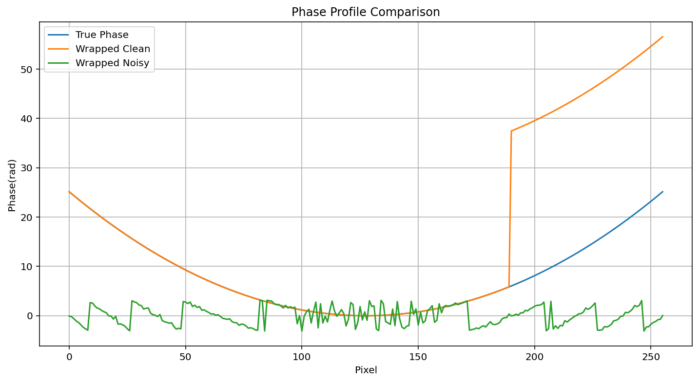
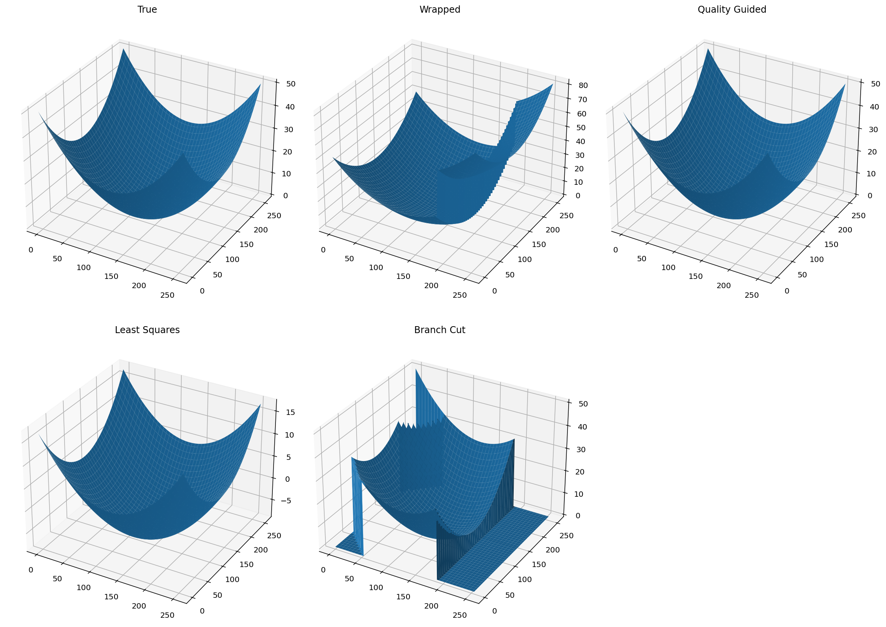
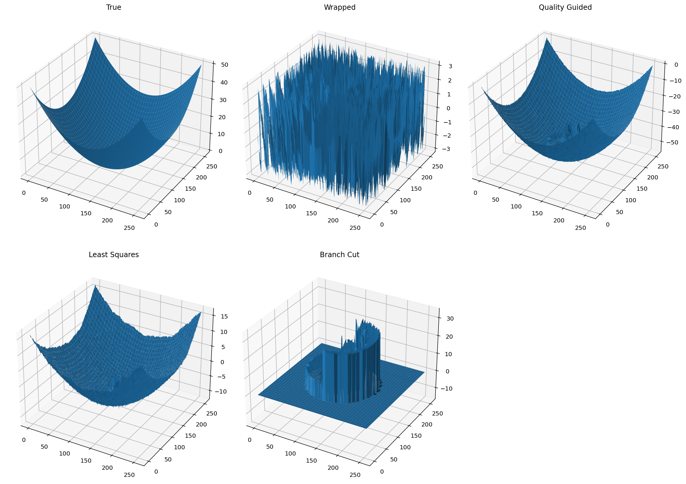
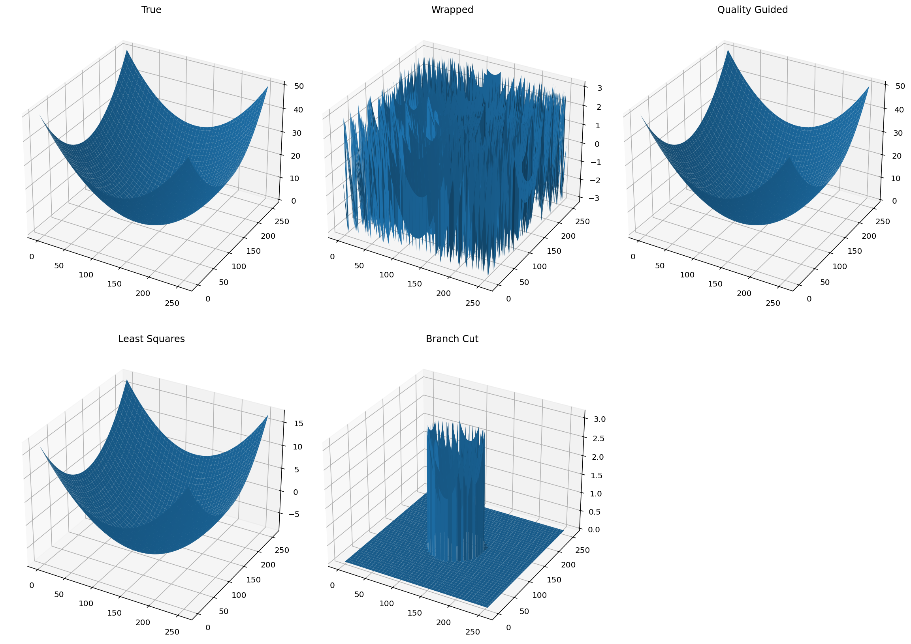

# 基于数字激光干涉的二维相位解包裹算法仿真与比较

基于数字激光干涉测量原理，构建二维球面波干涉模型，模拟干涉图生成、相位提取、相位包裹以及相位解包裹全过程，对不同相位解包裹算法的性能进行分析与比较。

项目主要完成以下内容：

1. 构建二维球面波真实相位模型；
2. 利用四步相移法生成干涉图；
3. 从干涉图中提取包裹相位（Wrapped Phase）；
4. 构造典型测试场景：

   * 理想球面波；
   * 球面波 + 台阶突变；
   * 球面波 + 失相关区域；
5. 分别采用不同解包裹算法恢复真实相位；
6. 对算法性能进行分析与评价。

---

- [理论基础](#理论基础)
- [仿真模型](#仿真模型)
- [解包裹算法](#解包裹算法)
- [仿真结果](#仿真结果)
- [结果分析](#结果分析)
- [结论](#结论)

# 理论基础

## 相位包裹现象

干涉测量中获得的相位通常满足：

$$
\phi(x,y)=\tan^{-1}\left(\frac{I_4-I_2}{I_1-I_3}\right)
$$

由于反正切函数的值域限制，所得相位只能位于：

$$
(-\pi,\pi]
$$

因此真实相位

$$
\Phi(x,y)
$$

经过测量后变为：

$$
\phi_w(x,y)=\Phi(x,y)\bmod 2\pi
$$

这种现象称为**相位包裹（Phase Wrapping）**。

相位解包裹（Phase Unwrapping）的目标即为恢复：

$$
\Phi(x,y)
$$

 

## 四步相移法

本项目采用四步相移法模拟真实干涉测量过程。

四幅干涉图分别为：

$$
I_1=A+B\cos\phi
$$

$$
I_2=A+B\cos(\phi+\frac{\pi}{2})
$$

$$
I_3=A+B\cos(\phi+\pi)
$$

$$
I_4=A+B\cos(\phi+\frac{3\pi}{2})
$$

则包裹相位可表示为：

$$
\phi_w=
\tan^{-1}
\left(
\frac{I_4-I_2}
{I_1-I_3}
\right)
$$

# 仿真模型

## 真实相位

采用二维球面波作为被测对象：

$$
\Phi(x,y)=A(x^2+y^2)
$$

其三维形貌为抛物面结构。

该模型具有以下特点：

* 连续光滑；
* 存在多个 (2\pi) 周期；
* 与实际干涉测量中的曲面测量问题相似。

## 台阶模型

为了测试算法对于不连续相位的处理能力，引入随机高度台阶：

$$
\Phi_s(x,y)=\Phi(x,y)
+
H(x,y)
$$

其中：

$$
H(x,y)=N\cdot2\pi
$$

表示相位突变。

此类问题对应实际测量中的：

* 台阶结构；
* 刻蚀深度测量；
* 表面缺陷检测。

 

## 失相关模型

为了模拟低信噪比区域，在干涉图中引入失相关区域。

失相关区域内：

* 条纹对比度降低；
* 噪声显著增强；
* 相位信息部分丢失。

对应实际应用中的：

* 表面反射率变化；
* 阴影区域；
* SAR干涉测量中的失相关区域。

 

# 解包裹算法

本项目比较三种典型算法。

 

## 1. Quality Guided

### 原理

首先建立质量图：

$$
Q=\frac{1}{|\nabla\phi|}
$$

随后：

* 从质量最高像素开始；
* 按质量从高到低扩展；
* 逐步恢复相位。

### 特点

优点：

* 实现简单；
* 运算速度快；
* 对连续相位效果良好。

缺点：

* 误差容易传播；
* 对大面积噪声敏感。

 

## 2. Least Squares

### 原理

首先计算包裹相位梯度：

$$
g_x=W(\Delta_x\phi)
$$

$$
g_y=W(\Delta_y\phi)
$$

然后求解泊松方程：

$$
\nabla^2 \Phi=\nabla\cdot g
$$

得到全局最优解。

### 特点

优点：

* 具有全局约束；
* 抗随机噪声能力较强；
* 不容易发生误差传播。

缺点：

* 会平滑真实边缘；
* 台阶处恢复精度下降。

 

## 3. 简化 Branch Cut

### 原理

Branch Cut 算法通过检测残差点（Residue）：

$$
\oint \nabla\phi,dl \neq 0
$$

建立分支切线（Branch Cut），阻止错误传播。

随后在允许区域内完成展开。

不过，完整 Branch Cut 算法过于复杂，不适合完全使用python自行复现。因此，仿真采用经简化的 Branch Cut 。

### 特点

优点：

* 能抑制局部错误扩散；
* 保持相位边缘较好。

缺点：

* 对分支切线构造敏感；
* 复杂场景容易出现孤立区域。

 

# 仿真结果

## 仿真数据（一维）



## 场景一：球面波 + 台阶



从结果可以观察到：

### Quality Guided

恢复结果与真实相位几乎一致。台阶边界得到较好保留，对于连续区域能够稳定展开。

 

### Least Squares

能够恢复整体趋势，但高度明显被压缩。相位最大值约为真实值的三分之一，说明泊松求解过程中出现了较强平滑效应，台阶边缘信息被削弱。

 

### 简化 Branch Cut

恢复结果存在明显截断区域，部分区域未被展开， 出现大面积零值区域，说明当前简化实现对于台阶区域较为敏感。


## 场景二：球面波 + 失相关区域



可以观察到：

### Quality Guided

整体轮廓仍然被正确恢复，失相关区域附近出现局部凹陷。说明质量引导策略能够有效避免部分错误传播。在三种算法中表现最稳定。

 

### Least Squares

恢复结果整体连续，但受到噪声影响明显。表面出现大量高频波动，同时高度范围被压缩。说明该方法虽然具有较好的全局鲁棒性，但会牺牲局部细节。

 

### 简化 Branch Cut

失相关区域附近出现严重失真，大量像素未被正确展开，形成明显孤立区域。说明当残差大量聚集时，简单 Branch Cut 实现难以得到可靠结果。


## 场景三：纯球面波



可以观察到：

### Quality Guided & Least Squares

整体轮廓符合预期，但 Least Squares 高度同样降低。理论上，对于无噪声数据，所有相位解包裹算法都应该表现良好。

### 简化 Branch Cut

整体出现严重失真。这可能是简化 Branch Cut 被错误简化导致的。

# 结果分析

从实验结果可以得到以下结论：

## 连续光滑相位

对于连续球面波：

* Quality Guided
* Least Squares

均能获得较好的恢复结果。

简化 Branch Cut 出现错误。

 

## 台阶相位

对于存在相位突变的问题：

Quality Guided 表现最好。

Least Squares 出现明显平滑。

简化 Branch Cut 部分区域失效。

 

## 失相关区域

对于强噪声区域：

Quality Guided 仍能保持整体结构。

Least Squares 保持全局连续性，但噪声较明显。

简化 Branch Cut 最容易出现展开失败。

 

# 结论

本项目基于数字干涉测量建立了完整的仿真流程：

```text
真实相位
    ↓
干涉图生成
    ↓
四步相移提取包裹相位
    ↓
相位解包裹
    ↓
结果评价
```

通过对三种典型算法进行比较，可以得到如下结论：

| 算法             | 平滑相位 | 台阶相位 | 失相关区域 | 计算复杂度 |
| -------------- | ---- | ---- | ----- | ----- |
| Quality Guided | 优秀   | 优秀   | 良好    | 低     |
| Least Squares  | 优秀   | 一般   | 良好    | 中     |
| 简化 Branch Cut | 错误   | 一般   | 较差    | 中     |

综合本次仿真结果，在当前测试条件下：

**Quality Guided 算法表现最佳。**

其在连续区域、台阶区域以及失相关区域中均表现出较好的鲁棒性与恢复能力。

Least Squares 算法具有较强的全局稳定性，但会牺牲边缘细节。

Branch Cut 算法理论上适用于处理残差问题，但当前简化实现可能出现错误，后续可进一步采用 Goldstein Branch Cut 或 MCF（Minimum Cost Flow）等工程级实现进行改进。
